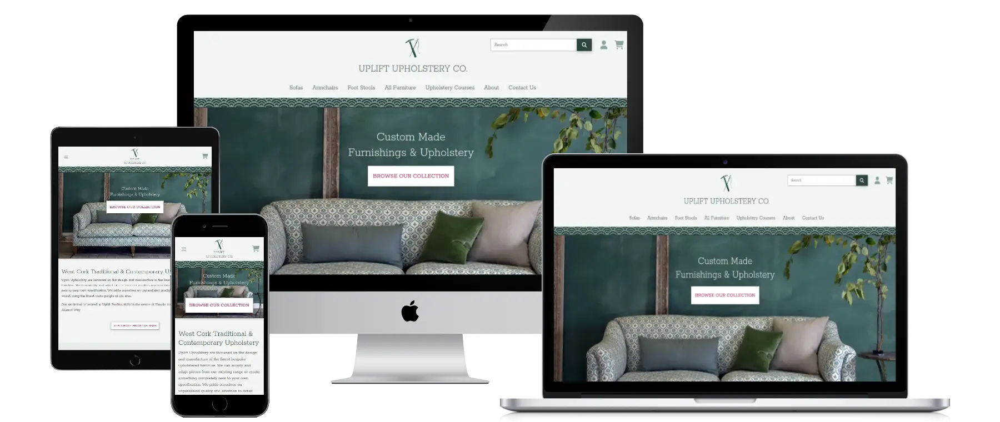
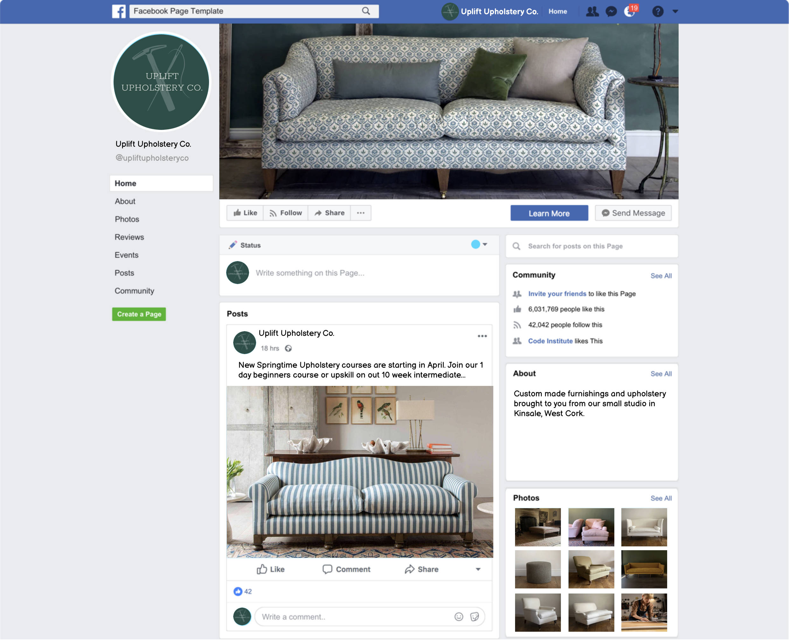
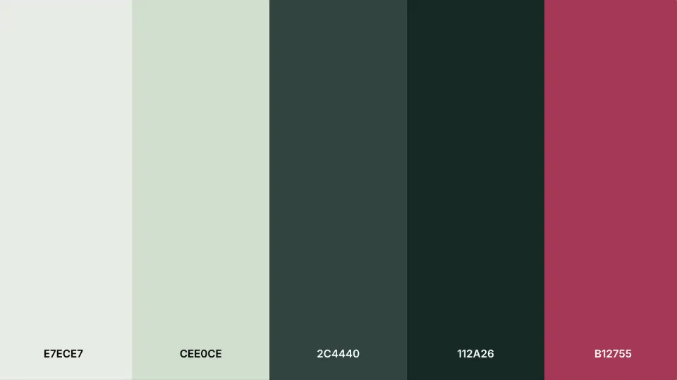
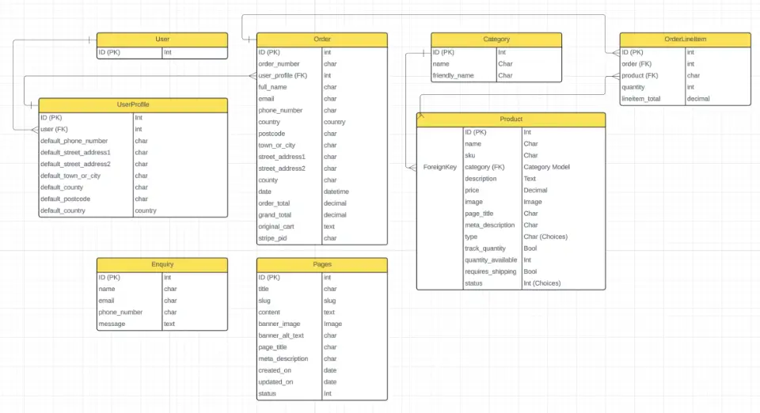

# Uplift Upholstery Co.
E-commerce site built on Django for CI PP5



Uplift Upholstery Co. is a small, fictional upholstery business based in Kinsale, Co. Cork. As well as designing and building a small range of custom furniture products in house which are sold onine via the website, they also provide a small range of upholstery courses for people looking to re-upholster and upcycle their own pieces of furniture, which can be booked on the website. 

[View the live site here](https://uplift-upholstery-1735a035f709.herokuapp.com/)

## Table of contents

- [E-commerce business model](#e-commerce)
- [SEO & Social Media Marketing](#seo)
- [Design & User Experience](#ux)
- [Future Features](#future-features)
- [Agile Development](#agile)
- [Technologies](#technologies)
- [Database Design](#db)
- [Testing](#testing)
- [Deployment](#deployment)
- [Credits](#credits)
- [Acknowledgements](#acknowledgements)

<a name="e-comerce"></a>
## E-commerce Business Model
This is a standard B2C ( Business to Consumer) business model where the business sells a small range of pre-designed custom made & upholstered furniture products from the website. The business also runs in person upholstery courses at their studio workshop, places for which can also be puchased from the website.


<a name="seo"></a>
## SEO & Social Media Marketing

### SEO
Keyword research was carried out using a free tier on [semrush.com](https://semrush.com) to find the highest value and most impactful short and long tail keywords that the business' target market would use to search for their products.
These keywords are then used in both the on page content that viewed by the website user (headings, paragraphs of text, product descriptions, etc) and off page content that usually only read by search bots but also by screen readers (page titles, meta descriptions, image alt text).
 
Custom page titles & meta descriptions were implemented in all page and product models to allow every page to be individually optimised.

### Sitemap
[XML-Sitemaps.com](https://xml-sitemaps.com) was used to generate [this sitemap](https://uplift-upholstery-1735a035f709.herokuapp.com/sitemap.xml) for the site. Once a site has been published to it's own custom domain, i.e. https://upliftupholstery.co, the sitemap would be submitted to [Google's Search console](https://search.google.com/search-console) and [Bing's Webmaster tools](https://www.bing.com/webmaster/tools) to pprompt thier searchbots to crawl and index the website's pages into their serach results.

### Robots.txt
A basic robots.txt file was added to the site root [here](https://uplift-upholstery-1735a035f709.herokuapp.com/robots.txt). The following directives were added to allow all bots (except ChatGPT) to crawl and index all pages on the site. 

```
User-Agent: *
Disallow: 

User-agent: GPTBot
Disallow: /

Sitemap: https://uplift-upholstery-1735a035f709.herokuapp.com/sitemap.xml
``` 

### Social Media
The following mockup of a Business facebook page was drawn up using the Balsamiq template provide by Code Institute:
.

Ideally, as this business operates in area of interior design, it would benefit more by leveraging platforms such Instagram an/or TikTok.

### Email Marketing
An account was set up for the business using [Campaign Monitor's email marketing platform](https://www.campaignmonitor.com/), a newsletter mailing list was added to the account and the sign up form code snippet was exported, customised and added to the footer of the website. It uses a double opt-in sign up process that requires users who sign up to verify their email address by clicking a confirmation link in the email issued after signing up. This prevents unwanted spam email addresses being acdded to the mailing list.
As a business that runs upholstery courses on an ongoing basis, an email newsletter is a very effective way to inform verified subscribers about up and coming courses. 

<a name="ux"></a>
## Design & User Experience

### Site Goals
The main goals for the site are as follows:

1. Sell custom made pieces of furniture
2. Provide upholstery courses to small groups throughout the year.


### Colour Palette
Predominantly cool shades of green were chosen with a splash of hot hibiscus pink to provide some highlight and contrast. The objective was provide a light, fresh, subtle and relatively neutral theme that would allow the upholstery fabrics to stand out without being overwhelmed. A narrow horizontal green patterned stripe serves to separate the header form the main content section of the site.

  

### Typography
The site uses [Rokkitt typeface](https://fonts.google.com/specimen/Rokkitt/about) by Vernon Adams, served by Google webfonts as a variable font. A characterful slab serif, it works well as a display font in headings but is also a nice clear alternative to sans serif typefaces at smaller body text sizes.


<a name="future-features"></a>
##Future Features
- Add a 'requires shipping' boolean field to the product model which enables the free shipping threshold calculations to be factored in or out, i.e. no shipping is required for booking a place on a course.
- Include an enquiry funnel and call to action for people who wish to get existing pieces of furniture re-upholstered.

<a name="agile"></a>
## Agile Development

Agile methodologies were used to deliver the product MVP. [Github Projects](https://github.com/bristlebird/uplift-upholstery-co/projects) and issues provided the agile tools to create a basic Kanban board on which tasks and user stories were tracked throughout the project development. [View the Kanban board here](https://github.com/users/bristlebird/projects/4).

MoSCoW prioritisation was used with the aid of Github project labels to streamline and prioritise tasks during development. To deliver the MVP, core requirements were tackled first, so the primary focus was given to 'must haves', followed by 'should haves' and finally 'could haves'.

User stories were grouped into Epics which were mapped to project milestones.

Each user story appears as a card on the kanban board with a set of acceptance criteria — this provided a task driven approach to see the project through.

<a name="technologies"></a>
## Technologies
- HTML / CSS / JavaScript — standard front end web technologies used to build out the responsive user interface
- [Bootstrap](https://getbootstrap.com/) — open-source CSS framework directed at responsive, mobile-first front-end web development
- [Python](https://www.python.org/) — main backend progamming language used for application logic
- [Django](https://www.djangoproject.com/) — Python MVC framework for building back end web app functionality
- [PostgreSQL](https://www.postgresql.org/) — object relational database system for storing app content and models
- [Heroku](https://heroku.com/) — for app deployment & hosting
- [Git](https://git-scm.com/) — for version control
- [Github](https://github.com/bristlebird/) — for code storage / this repository
- [Stripe](https://stripe.com) — used to handle secure payments
- [AWS S3](https://aws.amazon.com/s3/) — used for static file and media storage
- [Visual Studio Code for Mac](https://code.visualstudio.com/) — IDE used to write the code
- [Code Institute's Boutique Ado walkthrough project](https://github.com/Code-Institute-Solutions/boutique_ado_v1_sourcecode) provided a significant amount of the code and guidance on the techniques.

### Python Modules, Packages, Libraries & Frameworks:
- [asgiref](https://pypi.org/project/asgiref/) — standard interface between async-capable Python web servers, frameworks, and applications
- [dj-database-url](https://pypi.org/project/dj-database-url/) — utility for connecting Django to PostgreSQL
Django Storage API
- [django-allauth](https://docs.allauth.org/en/latest/) — used for account management, authentication & registration
- [django-crispy-forms](https://pypi.org/project/django-crispy-forms/) — used to render forms HTML
- [django-summernote](https://pypi.org/project/django-summernote/) — adds wysiwyg / rich text editor to form textfields
- [gunicorn](https://gunicorn.org/) — a Python WSGI HTTP Server
- [oauthlib](https://pypi.org/project/oauthlib/) — authentication library dependancy used by allauth package
- [Pillow](https://pypi.org/project/pillow/) — adds image processing capability to Python
- [psycopg2](https://pypi.org/project/psycopg2/) — PostgreSQL database adapter
- [PyJWT](https://pypi.org/project/PyJWT/) — Python library which allows you to encode and decode JSON Web Tokens
- [python3-openid](https://pypi.org/project/python3-openid/) — set of Python packages to support use of the OpenID, dependenancy of allauth
- [requests-oauthlib](https://pypi.org/project/requests-oauthlib/) — allauth dependancy
- [sqlparse](https://pypi.org/project/sqlparse/) — SQL parser for Python
- [urllib3](https://pypi.org/project/urllib3/) — HTTP client for Python


### Other Tools & Apps used
1. [Macdown](https://macdown.uranusjr.com/) — open source Markdown editor for macOS, used to create this README
2. [Lucid Charts](https://lucid.app/) — used to create ERD's
3. [Website Mockup Generator](https://websitemockupgenerator.com/) — to create responsive devices mockup for this Readme
4. [Affinity Photo 2](https://affinity.serif.com/en-gb/photo/) — for Image editing
5. [ImageOptim](https://imageoptim.com/mac) — for optimising images
6. [Font Awesome](https://fontawesome.com/) — used for various icons on the site
7. [Favicon.io](https://favicon.io) — used to generate app favicon
8. [Code Institute's Pep8 Python Linter](https://pep8ci.herokuapp.com/) — used to format python code and ensure it was free from errors
9. [Autopep8](https://marketplace.visualstudio.com/items?itemName=ms-python.autopep8) — Vscode extension for checking Python code
10. [Pylint](https://marketplace.visualstudio.com/items?itemName=ms-python.pylint) — Vscode extension for linting Python code


<a name="db"></a>
## Database Design
The following ERD (entity relationship diagram) was used to visualise the database models for the site.



The custom models used on the site are:

1. Products: contain several additional fields to track inventory and no. of places available for the course products as they would be limited to small groups. Setting the number of places available on a course prevents buyers from being able to purchae more places than have been made available. This does however require further development to update the remaining products / places available after each successful purchase. Other SEO related fields were also added to this model.
2. Enquiries: contains name, contact details and message submitted via the form on the contact page. The message is also emailed to the store owner.
3. Pages: the pages model is used to display supplementary pages ojn the site, i.e. the about page, Privacy policy, etc.


<a name="deployment"></a>
##  Deployment
This site has been deployed on Heroku from this Github repository — [view the live site here](https://uplift-upholstery-1735a035f709.herokuapp.com/).

Before deplying the site to Heroku, there are a few pre-requisites to get set up first.

### Sending Emails
Sending email from Heroku using Gmail App passwords — [see how to set this up here](https://support.google.com/mail/answer/185833?hl=en).
	- once you have your email account's App password, set this as the value for the `EMAIL_HOST_PASS` key in your Heroku config vars and `EMAIL_HOST_USER` key should have the value of your Gmail email address.

### Amazon AWS S3 storage
Create an S3 bucket for static file and media hosting. Help with this can be found [here](https://docs.aws.amazon.com/AmazonS3/latest/userguide/HostingWebsiteOnS3Setup.html). Once you have the access key id and secret access key for your AWS S3 bucket, you'll need to add them to your Heroku config vars as detailed below. 

### Heroku Deplyment
To deploy on Heroku, you'll need to fork or clone the project by hitting Github's fork or clone buttons at top of the repository and then follow these steps:

1. Get a free Heroku account [here](https://signup.heroku.com/).
3. When creating the account, choose the country you're in, set Python as the primary development language, set your password & agree to their terms of service.
4. When logged in to the dashboard, hit the 'Create new app' button.
5. Give your app a unique name, select your region & hit 'Create app'.
6. Once the app is created, hit the 'Settings' tab then 'Reveal Config Vars' & set your environment variables:
	- `DATABASE_URL`: your PostgreSQL database URL, i.e. postgresql://xxxxxxxx
	- `SECRET_KEY`: your Django projects secret key
	- `EMAIL_HOST_PASS`: user's own value
	- `EMAIL_HOST_USER`: user's own value
	- `STORE_OWNER_EMAIL`: user's own value
	- `STRIPE_PUBLIC_KEY:` user's own value
	- `STRIPE_SECRET_KEY`: user's own value
	- `STRIPE_WH_SECRET`: user's own value
	- `AWS_ACCESS_KEY_ID`: user's own value
	- `AWS_SECRET_ACCESS_KEY`: user's own value
	- `USE_AWS`: True

7. Hit the 'Deploy' tab, select 'Github' in the Deployment method section, hit the 'Connect to Github' button and sign in to Github to authorise the connection.
8. When connected, enter the repository name in the 'Search for a repository to connect to' field, hit 'search' & then 'Connect' for the chosen repository.
9. To deploy manually, select the'main' branch and hit the 'Deploy branch' button.
10. When deployed, click the 'View' button to open the deployed app in your browser.

<a name="testing"></a>
## Testing

### Mobile
The site was found to work consistently on Safari & Google Chrome browsers on an Apple iPhone 11. Further testing on Android devices is required. 

### Desktop
On desktop, the site was also found to work pretty consistently in Google Chrome, Mozilla Firefox, Microsoft Edge & Opera on Mac OS X 12.7.6 (Monterey). Further testing in browsers running on Windows desktop operating systems is also required.

### Validator Testing 

- HTML — No errors returned when passing through the official [W3C validator](https://validator.w3.org/nu/?doc=https%3A%2F%2Fuplift-upholstery-1735a035f709.herokuapp.com), except on the form pages that contain Summernote rich text editor (3rd party code over which I have no control of the output).
- CSS — No errors were found when passing through the official [(Jigsaw) validator](https://jigsaw.w3.org/css-validator/validator?uri=https%3A%2F%2Fuplift-upholstery-co.s3.amazonaws.com%2Fstatic%2Fcss%2Fbase.css&profile=css3svg&usermedium=all&warning=1&vextwarning=&lang=en) 

### Web Performance & Accessibility

Google Lighthouse scores are respectable enough with accessibility and SEO achieving 100 throughout, except for where the Summernote rich text editor is used to update content (i.e. product management). Performance scores could be furthe improved by the use of reponsive images, code minification, better caching and text compression.

#### Lighthouse results
[Home page](https://pagespeed.web.dev/analysis/https-uplift-upholstery-1735a035f709-herokuapp-com/5nuesq2qzd?form_factor=mobile) / [Product listing page](https://pagespeed.web.dev/analysis/https-uplift-upholstery-1735a035f709-herokuapp-com-products/k58s0mwr8r?form_factor=mobile) / [Product detail page](https://pagespeed.web.dev/analysis/https-uplift-upholstery-1735a035f709-herokuapp-com-products-3/onsrkx3gv5?form_factor=mobile) / [About page](https://pagespeed.web.dev/analysis/https-uplift-upholstery-1735a035f709-herokuapp-com-pages-about-us/kgdhitqqu2?form_factor=mobile) / [Contact page](https://pagespeed.web.dev/analysis/https-uplift-upholstery-1735a035f709-herokuapp-com-contact/9mxyahjwxn?form_factor=mobile)

#### Website Carbon
The home page achieves a carbon rating of A, only emitting 0.17g of CO2 on each page visit — [view the result here](https://www.websitecarbon.com/website/uplift-upholstery-1735a035f709-herokuapp-com/)

### User Story Testing

| Test | Result |
| -- | -- |
| USER STORY: View products — As a customer I can view a list of products so that I can choose what to buy. |  |
| products are displayed in a grid or list on the website | passed |
| user can access link to view products in main navigation | passed |
| USER STORY: View product details — As a customer I can view product details so that check price, description, rating, image & options. |   |
| provide clear link / call to action on product grid to view product details | passed |
| USER STORY: Product search — As a customer I can search for product by name or description so that I can buy or find out more information about a specific product. |  |
| A search input form is clearly visible to the user | passed |
| Relevant search results are displayed when search form is submitted | passed |
| USER STORY: Product category filter — As a customer I can view products in a specific product category so that narrow down the options and focus on the products that are more relevant to me. |  |
| selecting a specific category from a dropdown menu or link displays products within that category | passed |
| USER STORY: Sort products —As a customer I can sort list of products so that I can find the best value products by identifying which are top rated priced appropriately. |  |
| provide option to sort by price | passed |
| provide option to sort alphabetically | passed |
| USER STORY: Account registration — As a site user I can register for an account so that add profile, update personal info and address details so that they are saved for future re-use. |  |
| Registration form contains all necessary fields (name, email, password, password confirmation & submit button) | passed | 
| Registration form is easily accessible from main nav | passed | 
| Success message is visible when account has been created |passed |
| Error messages are displayed if wrong info is submitted | passed |
| USER STORY: Account verification — As a site user I can receive email confirmation after registration so that I can verify that my account registration succeeded.  |  | 
| email is received with confirmation of registration | passed | 
| USER STORY: Sign in — As a site user I can login with username & password so that I can access & update my account information & checkout without having to enter shipping & delivery details. |  |
| navigation options reflect logged in status (profile & log out link visible) | passed | 
| USER STORY: Update personal user profile — As a site user I can personalise & update my user profile so that view order history & keep contact details up to date if they change. |  |
| ability to update contact / address details | passed | 
| view list of past orders | passed | 
| ability to update / change password via update password form | passed | 
| USER STORY: Password recovery — As a site user I can reset my password so that I can access my account if I have forgotten/misplaced my password. |  |
| user can change / update password after clicking on reset link | passed | 
| user can receive password reset link by email | passed | 
| USER STORY: Add item to cart — As a customer I can choose product options & quantity so that I can make sure I'm buying the right variety & quantity of products for my needs. |  |
| quantity selector enables user to set item quantity before adding to cart | passed | 
| options selector enables user to choose product options before adding to cart | passed | 
| user can click a button to add the item to the cart  | passed | 
| USER STORY: View cart — As a customer I can view items I've chosen to purchase in the cart so that I can see the total cost of my order & review the items I'll receive before making a payment. |  |
| Cart icon link is visible in the navigation that takes the user to the cart page | passed | 
| Cart page displays current items in the cart | passed | 
USER STORY: Update cart — As a customer I can adjust quantities of relevant items in the cart so that I can buy the right amount of stuff. |  |
| user can use quantity selector to adjust quantities of item in cart | passed | 
| users can click a link to remove items from cart altogether | passed | 
| USER STORY: Pay securely — As a customer I can **feel my personal & payment details are secure ** so that I can provide my credit/debit card details to make a purchase with confidence. |  |
| user can enter card details via secure form | passed | 
| card validation informs user if details are supplied in incorrect format | passed | 
| card data transmitted to & handled securely by payment processor (Stripe)  | passed | 
| USER STORY: Order response — As a customer I can view a confirmation of my order after making a payment so that I can be sure that my order went through ok. |  |
| Order number and details are displayed after successful order | passed | 
| Error message is displayed if there was a problem with the order | passed | 
| Order notification email is sent to the customer | passed | 
| USER STORY: Order confirmation email — As a customer I can receive a confirmation of my order by email after completing checkout so that I can keep a record of my purchase for accounting, warranties, etc. |  |
| email containing details of their order is emailed to the customer | passed | 
| USER STORY: Staff order notification — As a store owner I can receive an email notification of a customer order so that I can deliver their product in a timely manner or send them further details about the course they booked. |  |
| email containing customer & order details is delivered to the store owner | passed | 
| USER STORY: Add products — As a store owner I can add products to my store database so that I can make them available for sale online via my website. |  | 
| logged in store admin can navigate to an add product page from account menu | passed | 
| add product page contains a form with all the necessary product fields | passed | 
| form fields ar correctly validated | passed | 
| submitting form adds product to the database | passed | 
| add product page only accessible to store admin | passed | 
| USER STORY: Update product status — As a store owner I can hide products from the store without deleting them so that I can make them available on my store again when new stock becomes available. |  |
| logged in store admin view inactive products on the front end | passed | 
| logged in store admin can click edit link to edit product | passed | 
| edit product page contains a form with all the necessary product fields pre-populated from database | passed | 
| form fields are correctly validated | passed | 
| submitting form updates product info & status on the database | passed | 
| product edit page is only accessible to logged in store admin | passed | 
| USER STORY: Update product info — As a store owner I can edit & update products so that I can amend product prices, descriptions, images etc when required. |  |
| logged in store admin can click edit link to edit product | passed | 
| edit product page contains a form with all the necessary product fields pre-populated from database | passed | 
| form fields are correctly validated | passed | 
| submitting form updates product info on the database | passed | 
| product edit page is only accessible to logged in store admin | passed | 
| USER STORY: Delete products — As a store owner I can delete products so that I can remove them from store when they are no longer needed. |  |
| logged in store admin can click delete link to delete a product | passed | 
| store owner is asked to confirm product deletion | passed | 
| product is removed from the database | passed | 
| delete product link is only accessible to logged in store admin | passed | 
| USER STORY: View courses — As a learner I can view list of upcoming courses so that I can choose whether to enrol. |  |
| clear access to list of courses | passed | 

<a name="credits"></a>
## Credits

### Code
- [Django docs](https://docs.djangoproject.com/en/5.1/)
- [Customizing error views (Django docs)](https://docs.djangoproject.com/en/3.2/topics/http/views/#customizing-error-views)
- [Bootstrap docs](https://getbootstrap.com/docs/5.3/getting-started/introduction/)
- LearnDjango.com: 
    - [Customizing Django 404 and 500 Error Pages](https://learndjango.com/tutorials/customizing-django-404-and-500-error-pages)
    - [Add robots.txt to Django website](https://learndjango.com/tutorials/add-robotstxt-django-website)
- [Django contact form](https://mailtrap.io/blog/django-contact-form/)
- Django authentication system: [Login required decorator used to restrict CRUD functions to logged in users](https://docs.djangoproject.com/en/5.1/topics/auth/default/#the-login-required-decorator)
- Code Institute's Django blog & Boutique Ado walkthrough projects

### Design 
- Fonts: default System UI from Bootstrap for a clean & fast user interface, no need add Google fonts.
- [Color namer by Chirag Mehta](https://chir.ag/projects/name-that-color/) — for naming hex colors in css custom properties
- [ColorKit's colour contrast checker](https://colorkit.co/contrast-checker/5e2753-e0edd2/) — for checking colour contrast 

### Content & Media
- [Noble Tetbury](https://www.nobletetbury.com/) — product images & copy
- [Corn Upholstery](https://www.cornupholstery.com/) — logo mark
- [Lorfords Contemporary](https://lorfords.com/) — Hero images.
- [iStockphoto](https://iStockphoto.com/) — used for course product images

<a name="acknowledgements"></a>
## Acknowledgements
- CI mentors: [Gareth McGirr](https://github.com/Gareth-McGirr) and...
- CI cohort supervisors: [Lewis Dillon](https://github.com/LewisMDillon) for their helpful guidance, enthusiasm and encouragement throughout the project.
